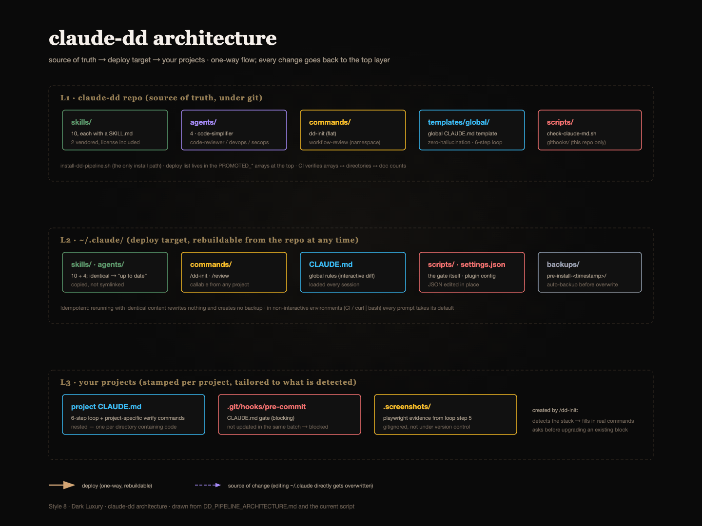
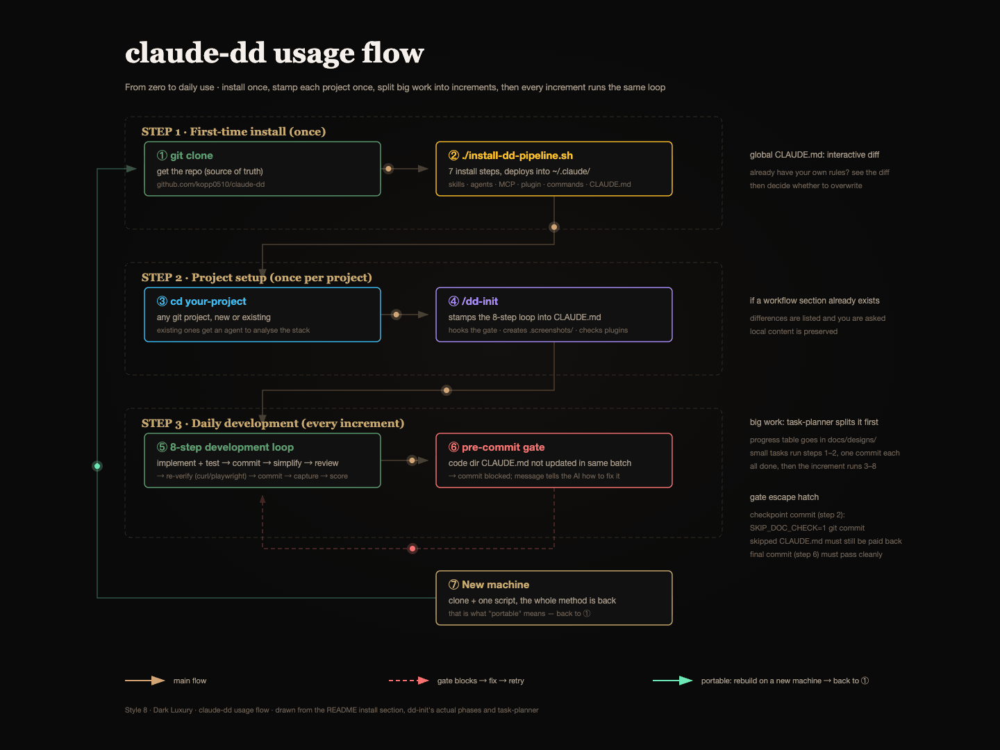

[English](README.md) | [繁體中文](README.zh-TW.md)

# DD Pipeline (claude-dd)

> A portable Claude Code profile — turning "did the AI actually follow the rules?" into output you can see and gates that can block you



**What it is**: a Claude Code profile you can carry between machines — skills, agents, commands, and a global `CLAUDE.md`. Clone the repo, run one bash script, and your whole working style is installed into `~/.claude/`. This repo is the source of truth; `~/.claude/` is always a deployment of it.

**What it actually does**: three things, with honestly different strengths.

1. **A pre-commit hook that blocks commits** when a directory containing code has no `CLAUDE.md`, or has one that wasn't staged in the same commit. This one is real enforcement — it's a shell script with `exit 1`, it doesn't care what the AI decided.
2. **A global `CLAUDE.md`** that tells Claude to cite a source for API signatures, version numbers, and project facts, and bans hedges like "should be" / "probably".
3. **A 7-step loop** stamped into each project's `CLAUDE.md` so every feature increment goes through simplify → review → re-verify before the final commit.

Be clear about the difference: only #1 is enforcement. Claude Code loads `CLAUDE.md` as context, not as configuration — [the docs say so plainly](https://code.claude.com/docs/en/memory) ("Claude treats them as context, not enforced configuration"). #2 and #3 raise the floor and leave a record you can audit; they do not guarantee compliance. Anything that must happen every time belongs in a hook, which is exactly why the gate exists.

**Who it's for**: you already use Claude Code daily, you keep re-typing the same corrections, and you want that to survive a machine change. Roughly: one developer (or a small team that agrees on conventions) who would rather have a commit blocked than discover three weeks later that a directory's docs stopped matching its code.

**Who it's not for**: if you want a lightweight setup, this is the wrong end of the trade — the gate will block you, and on a bad day you'll be writing a `CLAUDE.md` for a directory you only meant to touch once. If your team doesn't already agree that stale docs are a real problem, this will read as bureaucracy, because that's what an unwanted gate is. And the rule text is all Traditional Chinese (see the language note below).

```bash
git clone https://github.com/kopp0510/claude-dd.git
cd claude-dd && ./install-dd-pipeline.sh
```

> **Language note**: the rules themselves — the global `CLAUDE.md` template, the skill definitions, and the installer's console output — are written in Traditional Chinese, because that is the language the author works in. The mechanisms (the pre-commit gate, the CI checks, the loop) are language-independent and work as-is; the prose is not. Translating the global template is the one change to make if you want to adopt this in another language.

## Highlights

- **7-step development cycle** — every feature increment runs the same loop: implement + test → commit → code-simplifier → code-review → re-verify against a real environment (curl / playwright) → commit
- **CLAUDE.md pre-commit gate** — a commit is blocked when a directory containing code has no `CLAUDE.md`, or has one that wasn't updated in the same batch. The rejection message doubles as instructions the AI agent can act on to fix it itself
- **Zero-hallucination policy** — API signatures, version numbers, and project facts must carry a source annotation; hedges like "should be" or "probably" are banned outright rather than tolerated
- **Explicit skill triggering** — when a skill should have fired and didn't, a concrete reason must be written out, turning "I skipped it" from a black box into an auditable line
- **Usage-inventory model** — only components with an evidenced usage record are kept, and all of them ship by default, so idle skills don't eat context
- **Global CLAUDE.md template** — the single source for all of the above, deployed to `~/.claude/CLAUDE.md` through an interactive diff (`--force` overwrites it directly instead, backing the old one up)

## Installation

### Prerequisites

- [Claude Code CLI](https://claude.com/claude-code), Node.js, Git, Bash — all four are hard requirements; the installer exits if one is missing
- Required MCP: `playwright` — the installer checks for it but will not install it, so set up [playwright MCP](https://github.com/microsoft/playwright-mcp) first
- **`jq` or `python3`** (either one) — soft dependency. Without both, the plugin step is skipped entirely and the MCP check degrades to string matching, reporting "疑似已設定…範圍未知" instead of a real scope. The install still succeeds, so it's easy to miss that you got less than advertised
- Optional: `ffmpeg` — used by tech-diagram-gif for GIF export. Without it that skill degrades to delivering SVG instead of failing. On macOS: `brew install ffmpeg`
- The claude-md-management plugin must already be present locally (via the official marketplace). The installer only registers a plugin it can already find on disk — it never downloads one

### First-time install

```bash
git clone https://github.com/kopp0510/claude-dd.git
cd claude-dd
./install-dd-pipeline.sh
```

> If `install-dd-pipeline.sh` isn't executable, run `chmod +x install-dd-pipeline.sh` first.

The installer reports its progress as 7 steps (`1/7` … `7/7`):

1. Check the environment (the hard requirements above; missing any one aborts the install)
2. Install 10 promoted Skills into `~/.claude/skills/`
3. Install 4 promoted Agents into `~/.claude/agents/` (local backups of code-simplifier / code-reviewer, plus senior-devops / security-auditor)
4. Check MCP servers (read-only — reports scope, installs nothing)
5. Register the official plugin (claude-md-management — the dependency behind nested CLAUDE.md maintenance). Prints `Plugin 檔案不存在` and moves on if the plugin isn't already on disk
6. Install the `/dd-init` command and the `workflow-review` namespace into `~/.claude/commands/`
7. **Diff the global CLAUDE.md** (`~/.claude/CLAUDE.md`): if it differs from the repo template, the diff is shown and you're asked whether to overwrite — keeping your local copy is the default. **On a machine with no global CLAUDE.md yet, this step asks whether to install it and defaults to No** (non-interactive runs take the default too) — answer `y`, or use `--force`, to actually get the full profile. `--force` also skips the diff prompt and overwrites; see [Upgrading](#upgrading)

Plus one unnumbered step that deploys `check-claude-md.sh` (the pre-commit gate itself) into `~/.claude/scripts/`.

### Install options

```bash
./install-dd-pipeline.sh --help              # show help
./install-dd-pipeline.sh --check             # check the environment only, install nothing
./install-dd-pipeline.sh --force             # reinstall, overwriting existing files
./install-dd-pipeline.sh --commands-only     # install commands only
./install-dd-pipeline.sh --update            # update skills and agents
./install-dd-pipeline.sh --uninstall         # remove what this repo deployed
./install-dd-pipeline.sh --uninstall --yes   # uninstall without confirmation (for automation; in non-interactive environments every prompt takes its default)
```

### Sharing with others

There is exactly one installation path, and it carries the complete working method — global rules, the 7-step cycle, the pre-commit gate, and the curated components:

```bash
git clone https://github.com/kopp0510/claude-dd && cd claude-dd && ./install-dd-pipeline.sh
```

The global CLAUDE.md goes through an interactive diff, so someone who already has their own global rules can inspect the difference before deciding. Someone with no global CLAUDE.md at all gets a yes/no install prompt instead, defaulting to No — so nobody's `~/.claude/CLAUDE.md` is created or replaced without an explicit yes (or `--force`).

> A plugin-marketplace distribution route was evaluated and removed on 2026-08-04 after it was proven to work. The plugin mechanism cannot deploy a global CLAUDE.md or a pre-commit gate — it can only ship a subset of components, which contradicts the "complete working method" framing. Removed to keep a single path. The implementation is in the git history.

## Upgrading

Routine update:

```bash
git pull && ./install-dd-pipeline.sh --force
```

> **`--force` overwrites your global `CLAUDE.md` without asking.** The interactive diff described above only runs *without* `--force`. The previous version is backed up to `~/.claude/backups/pre-install-<timestamp>/` and the path is printed in the completion message, so it is recoverable — but if you have local edits you want to keep, run the installer without `--force` first and choose `k` (keep local).

For upgrades from older layouts (the everything-deployed and bucketed eras) and for moving an existing project onto the 7-step cycle, see [UPGRADING.md](UPGRADING.md) *(Traditional Chinese)*.
Structural changes over time are in [CHANGELOG.md](CHANGELOG.md) *(Traditional Chinese)*.

## The core loop: 7-step development cycle

Every **feature increment** runs this (defined in global CLAUDE.md §3.9; the project-specific version is stamped in by `/dd-init`):

```
1. Implement + get the first round of tests passing (never enter a commit with a red light)
2. commit (first one — preserves a restore point from before simplification)
3. code-simplifier (on that increment's diff)
4. code-review (on that increment's diff, run in full; Critical/Important findings must be fixed before continuing)
5. Re-verify — rerun the tests, plus curl against the real API / drive a real browser with playwright (screenshots go to .screenshots/)
6. commit (final version)
7. Capture what this round taught you (only if there is something) — `/revise-claude-md` folds any gotcha, command or convention into `CLAUDE.md`
```

Step 7 is the only skippable step, and the only one that asks you first: it proposes the additions and waits for approval. It handles session learnings, which is a separate concern from the code-changed-so-docs-must-follow sync the gate enforces.

Three quality mechanisms, one axis each: the simplifier owns readability, code-review owns correctness and compliance (including a 12-item Fowler code-smell baseline), and real-environment verification owns behaviour.

Step 1 proves the thing you built is right; step 5 proves that simplifying it and applying review findings didn't break it. Different purposes — neither substitutes for the other.

The full path from zero to daily use (install once, stamp each project once, then every feature increment runs the same loop):



### CLAUDE.md maintenance rules (enforced by pre-commit gate)

- Every folder containing code needs a `CLAUDE.md`; it is updated in the same batch as the code, and the update cascades upward through the parent layers
- The gate is `~/.claude/scripts/check-claude-md.sh`, hooked in by `/dd-init`. It goes into `.git/hooks/pre-commit`, unless `git config core.hooksPath` is set — git ignores `.git/hooks/` entirely in that case, so the hook goes into that directory instead. (This repo is itself in the second case.) Its error message tells the AI agent directly to read the directory, generate or update the file itself, and retry
- It only fires on code extensions (`js|ts|py|go|rs|sh|…`) and skips `node_modules`, `dist`, `.screenshots`, `migrations` and friends. Touching only markdown or config never triggers it
- Escape hatch for checkpoint commits (step 2): `SKIP_DOC_CHECK=1 git commit`. The final commit (step 6) must pass cleanly

## Why nested CLAUDE.md files

The gate demands one `CLAUDE.md` per code-bearing directory rather than one big file at the root. That's a deliberate trade, and it isn't free.

**The mechanism** (from the [official docs](https://code.claude.com/docs/en/memory)): `CLAUDE.md` files *above* your working directory are "loaded in full at launch", while files in *subdirectories* "load on demand when Claude reads files in those directories". Everything discovered is concatenated, not overridden, ordered from the filesystem root down — so the file closest to where you're working is read last.

**Why it's worth it**

- **Context is the scarce resource.** The docs recommend keeping a single `CLAUDE.md` under 200 lines, because "longer files consume more context and reduce adherence". A monorepo can't describe every subsystem in 200 lines. Nesting lets `src/api/CLAUDE.md` cost nothing until Claude actually opens something in `src/api/`.
- **`@import` does not solve this.** It's the obvious alternative and it doesn't work for context: imported files "still load and enter the context window at launch". Splitting a big file into imports buys you organization, not budget. Real subdirectory files are the only mechanism that defers loading.
- **The docs go where the change goes.** A rule about the API layer sitting next to the API layer is more likely to be updated when that layer changes — which is precisely what the gate enforces by requiring the same-batch update.

**What it costs, what's already mitigated, and what's left**

- **Documentation theatre.** The gate verifies a file exists and was staged. It cannot verify the content is true.
  *Mitigation*: §3.9 of the global template dictates the repair format when the gate fires — read every file in the directory, then write "one line on this layer's job → key files and their purpose → conventions and constraints here → relationship to the parent", with an explicit ban on placeholder or shell content.
  *Residual*: that rule is context, not enforcement. A determined shortcut still passes. The gate raises the cost of faking it; it doesn't make faking impossible.
- **Friction on small changes.** Adding a `CLAUDE.md` for a directory you only meant to touch once is real overhead.
  *Mitigation*: the gate only fires on code extensions and skips `node_modules`, `dist`, `.screenshots`, `migrations` and friends, so markdown, config and asset changes never trigger it; `SKIP_DOC_CHECK=1` covers checkpoint commits.
  *Residual*: the first commit that puts code into a genuinely new directory does cost you a file. That's the deal, and the escape hatch is only as strong as your willingness not to reach for it.
- **More files, more contradictions.** "If two rules contradict each other, Claude may pick one arbitrarily."
  *Mitigation*: `claude-md-improver` (from the claude-md-management plugin) is the tool for this cleanup — it audits existing files against a quality baseline. (`/revise-claude-md` is a different job: folding this session's learnings in at loop close-out.) §3.9 also asks for a cascade check up the parent layers after each change.
  *Residual*: nothing *detects* a contradiction. Those are tools you have to decide to run; the docs put the periodic review on you.
- **Nested files don't survive `/compact`.** Per the docs, root `CLAUDE.md` is re-injected after compaction but nested files "are not re-injected automatically; they reload the next time Claude reads a file in that subdirectory".
  *Mitigation*: in practice, editing code in that directory means reading a file there first, which reloads it.
  *Residual*: a narrow one — changing a directory's code from memory after a compaction without reading anything in it. That's already a bad habit; this just adds a reason not to.

If those trade-offs still sound worse than the problem you have, use a single root `CLAUDE.md` and don't install the gate. The 7-step loop works without it.

## Commands

| Command | Description |
|---------|-------------|
| `/dd-init` | Initialise a project: stamp the 7-step cycle into `CLAUDE.md`, hook up the pre-commit gate, create `.screenshots/` (only when the project has a frontend — pure backend/CLI skips it), verify plugin dependencies |
| `/workflow-review:review` | Combined code review — security, performance, configuration. It's a namespaced command, so the colon form is the callable name |

## Promoted Skills (10, deployed by default)

> "Promoted" means the component has an evidenced usage record and therefore ships by default. Components without one were removed rather than kept around — the git history holds them.

| Skill | Description |
|-------|-------------|
| code-simplifier | Code simplification (the wrapper used at step 3 of the loop) |
| design-brainstorm | Socratic design dialogue — look facts up yourself, only ask the human about decisions |
| frontend-design | Frontend visual design |
| review | Combined-review wrapper |
| self-improving-agent | Memory auditing and knowledge distillation |
| task-planner | Micro-task breakdown |
| tech-diagram-gif | Technical diagrams with GIF export (style specs vendored from [fireworks-tech-graph](https://github.com/yizhiyanhua-ai/fireworks-tech-graph)) |
| verification-gate | Pre-completion gate — claiming done requires fresh evidence |
| worktree-manager | Git worktree isolation |
| writing-great-skills | Reference for writing skills (vendored from [mattpocock/skills](https://github.com/mattpocock/skills), user-invoked) |

## Official plugins (managed by the installer)

| Plugin | Purpose |
|--------|---------|
| claude-md-management | Auditing and updating nested CLAUDE.md files (`claude-md-improver` skill + `/revise-claude-md`) — the documentation-maintenance dependency of the 7-step cycle |

### Recommended third-party plugin (not managed by the installer)

| Plugin | Purpose | Install |
|--------|---------|---------|
| [claude-mem](https://github.com/thedotmack/claude-mem) | Cross-conversation memory (records sessions via lifecycle hooks, with bundled search tools) | `npx claude-mem install` |

> claude-mem installs as a **plugin**, not an MCP server — it never registers under `mcpServers` in `~/.claude.json`, so the installer's MCP check cannot see it and does not try to.

## MCP

The installer checks for MCP servers but never installs them, and it **distinguishes configuration scope**. A ✅ requires the server to be under the root `mcpServers` key of `~/.claude.json` (official scope name `user`, available in every project). A server configured only under an individual project (official scope `local`) is reported as "configured in N projects only" — it is unavailable elsewhere, which for a working method built around portability is equivalent to not installed.

Degraded states are reported distinctly, so "I can't tell" never turns into a confident claim:

| Situation | Reported as |
|---|---|
| `~/.claude.json` can't be parsed (corrupt) | 無法判定 — cannot determine |
| Neither `jq` nor `python3`, name found by string match | 疑似已設定…範圍未知 — probably configured, scope unknown |
| Neither `jq` nor `python3`, name not found | 未安裝 — not installed (a required MCP also gets a ❌) |

That last row is the honest caveat: without `jq` or `python3` the check falls back to string matching, and a server whose name doesn't literally appear in the file is reported as missing even though the check can't actually prove it.

> **Limitation**: the third official scope (`project` — a `.mcp.json` in the project root) does not live in `~/.claude.json`, so this check cannot see it and will under-report in that case. For the complete picture use `claude mcp list`, which lists all three scopes.

When installing an MCP server, specify user scope so it is available in every project:

```bash
claude mcp add --scope user context7 -- npx -y @upstash/context7-mcp@latest
```

### Required

| MCP | Description | Source |
|-----|-------------|--------|
| playwright | Browser automation (frontend verification at step 5 of the loop) | [playwright-mcp](https://github.com/microsoft/playwright-mcp) |

### Optional

| MCP | Description | Source |
|-----|-------------|--------|
| context7 | Version-accurate official library documentation (backs global CLAUDE.md §2.5, "never infer an API from its name") | [@upstash/context7-mcp](https://github.com/upstash/context7) |
| sequential-thinking | Sequential reasoning | [@modelcontextprotocol/server-sequential-thinking](https://www.npmjs.com/package/@modelcontextprotocol/server-sequential-thinking) |
| serena | Code assistant | [serena](https://github.com/oraios/serena) |
| zeabur | Cloud deployment platform | [zeabur-mcp](https://zeabur.com/docs/en-US/mcp) |
| google-docs | Google Docs integration | [google-docs-mcp](https://github.com/a-bonus/google-docs-mcp) |
| googleDrive | Google Drive integration | [gdrive-mcp-server](https://github.com/felores/gdrive-mcp-server) |

## Cleaning up foreign leftovers (manual)

The installer only manages what **this repo deployed**. Leftovers written into `~/.claude/skills/` by other sources — third-party skill installers, older install bundles — have to be cleaned up by hand. The known shapes and the commands to find them are documented in [CLAUDE.md, "殘留清理（手動）"](CLAUDE.md#殘留清理手動) *(Traditional Chinese)*, kept there as the single maintenance source so two documents can't go stale independently.

## License

MIT License

Vendored content: `skills/writing-great-skills/` (from [mattpocock/skills](https://github.com/mattpocock/skills), MIT); the Fowler smell baseline section of `agents/code-reviewer.md` is adapted from the same source.

## Contributing

Issues and pull requests are welcome.
