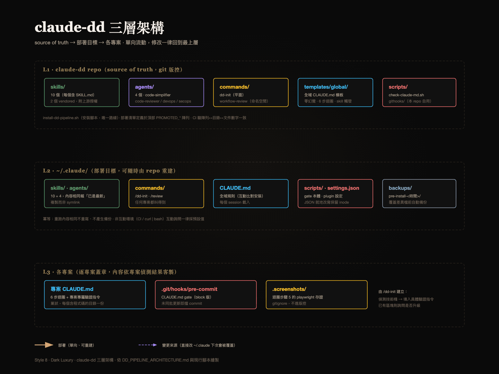
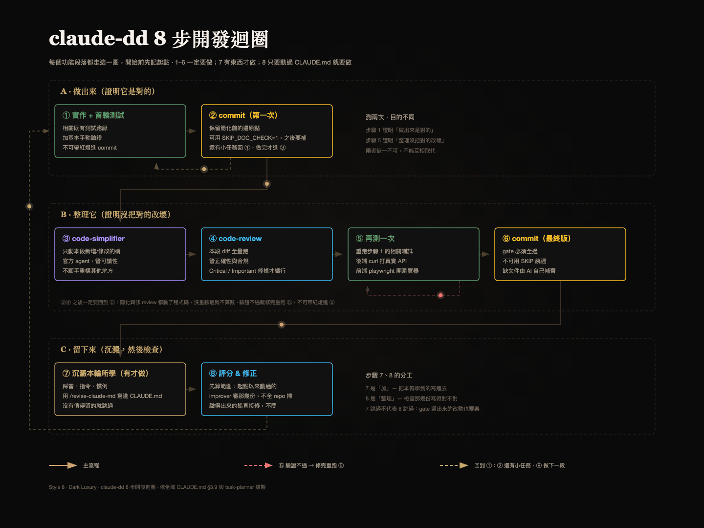
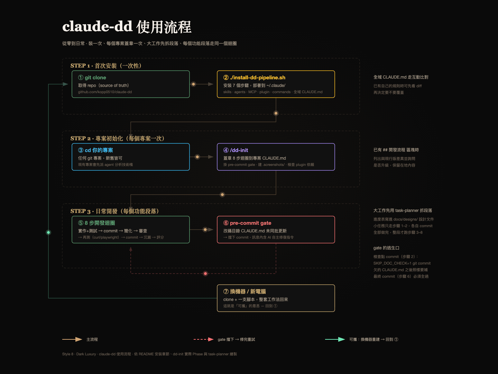

[English](README.md) | [繁體中文](README.zh-TW.md)

# DD Pipeline（claude-dd）

> 可攜式 Claude Code 設定庫 — 把「AI 有沒有照規矩做」變成看得見、擋得住的輸出



**是什麼**：跨機器可攜的 Claude Code profile（skills / agents / commands / 全域 CLAUDE.md）。
`git clone` 後跑一支 bash，整套工作習慣就裝進 `~/.claude/`；此 repo 是 source of truth。

**實際做了什麼**：三件事，強度誠實地不一樣。

1. **一個會擋 commit 的 pre-commit hook** — 改碼目錄沒有 `CLAUDE.md`、或有但沒跟這次 commit 一起 staged，就擋下。這條是真的強制：一支 shell 腳本 `exit 1`，跟 AI 怎麼想無關。
2. **一份全域 `CLAUDE.md`** — 要求涉及 API 簽名、版本號、專案事實時標註來源，並把「應該是」「大概」列為禁用詞。
3. **一個 8 步迴圈** — 由 `/dd-init` 蓋章進各專案的 `CLAUDE.md`，每個功能段落都要走簡化 → 審查 → 再驗證才進最終 commit。

差別要講清楚：**只有第 1 條是強制**。Claude Code 是把 `CLAUDE.md` 當 context 載入而非設定，[官方文件寫得很直白](https://code.claude.com/docs/en/memory)（"Claude treats them as context, not enforced configuration"）。第 2、3 條抬高下限、留下可稽核的紀錄，但不保證照做。**必須每次都發生的事得寫成 hook** — gate 就是為此存在。

**適合誰**：你每天在用 Claude Code，發現自己一直在重打同樣的糾正，而且希望換台機器後這些還在。具體一點：一個人（或已經對慣例有共識的小團隊），寧可被擋下 commit，也不想三週後才發現某個目錄的文件早就跟程式碼對不上了。

**不適合誰**：想要輕量設定的話，這是取捨的另一端 — gate 會擋你，運氣不好的那天你會為了一個只想順手改一下的目錄補寫 `CLAUDE.md`。如果你的團隊還沒有「文件過期是真問題」的共識，這套會被當成官僚流程 — 不被需要的閘門本來就是那樣。另外整套規則本文、skill 定義與安裝腳本輸出都是繁體中文，要給英語系團隊用得先翻譯（機制本身與語言無關，照跑）。

```bash
git clone https://github.com/kopp0510/claude-dd.git
cd claude-dd && ./install-dd-pipeline.sh
```

## 特色

- **8 步開發迴圈** — 每個功能段落必走：實作+測試 → commit → code-simplifier → code-review → 再測（curl/playwright 真實環境）→ commit
- **CLAUDE.md pre-commit gate** — 改碼目錄缺 CLAUDE.md 或未同批更新即擋 commit（block 版），錯誤訊息內建 AI 自主修復指令
- **零幻覺政策** — 涉及 API 簽名、版本號、專案事實時必須標註來源；「應該是」「大概」等模糊詞列為禁用
- **Skill 觸發顯性化** — 該觸發卻不觸發時必須寫出一行具體理由，讓「跳過」從黑箱變成可稽核紀錄
- **使用率盤點制** — 只保留有實證使用紀錄的元件並全數預設部署，避免閒置 skill 吃 context
- **全域 CLAUDE.md 模板** — 上述守則的單一來源，互動式比對部署到 `~/.claude/CLAUDE.md`（`--force` 則直接覆蓋，舊版自動備份）

## 安裝

### 前置需求

- [Claude Code CLI](https://claude.com/claude-code)、Node.js、Git、Bash — 四者皆為硬性需求，缺一安裝腳本會中止
- 必要 MCP：`playwright`（腳本只檢查不安裝，請先[安裝 playwright MCP](https://github.com/microsoft/playwright-mcp)）
- **`jq` 或 `python3`（擇一）** — 軟性依賴。兩者皆缺時 plugin 步驟整步跳過，MCP 檢查退化成字串比對、回報「疑似已設定…範圍未知」而非真實 scope。安裝仍會成功，所以很容易沒注意到拿到的是縮水版
- 可選：`ffmpeg`（tech-diagram-gif 的 GIF 匯出用；缺少時該 skill 退化交付 SVG。macOS `brew install ffmpeg`）
- claude-md-management plugin 需已透過官方 marketplace 存在於本機。安裝腳本只登記「已在磁碟上找得到」的 plugin，不會下載

### 首次安裝

```bash
git clone https://github.com/kopp0510/claude-dd.git
cd claude-dd
./install-dd-pipeline.sh
```

> 若 `install-dd-pipeline.sh` 沒有執行權限，先 `chmod +x install-dd-pipeline.sh`。

安裝腳本的進度顯示為 8 步（`1/7` … `7/7`）：

1. 檢查基礎環境（上述硬性需求，缺一即中止）
2. 安裝 10 個 promoted Skills 到 `~/.claude/skills/`
3. 安裝 4 個 promoted Agents 到 `~/.claude/agents/`（code-simplifier / code-reviewer 官方備份 + senior-devops / security-auditor）
4. 檢查 MCP（唯讀 — 只回報 scope，不安裝任何東西）
5. 登記官方 Plugin（claude-md-management — 巢狀 CLAUDE.md 維護依賴）。plugin 不在磁碟上時印「Plugin 檔案不存在」後跳過
6. 安裝 `/dd-init` + `workflow-review` 命名空間 Command 到 `~/.claude/commands/`
7. **比對全域 CLAUDE.md**（`~/.claude/CLAUDE.md`）：若與 repo 模板不同，顯示 diff 並詢問是否覆蓋（預設保留本地）。**全新機器上本機還沒有全域 CLAUDE.md 時，這步是詢問是否安裝且預設「否」**（非互動環境同樣採預設值）— 要拿到完整 profile 得答 `y` 或帶 `--force`。`--force` 同時會跳過 diff 詢問直接覆蓋，見[升級](#升級)

另有一個不列入編號的附加步驟：部署 `check-claude-md.sh`（pre-commit gate 本體）到 `~/.claude/scripts/`。

### 安裝選項

```bash
./install-dd-pipeline.sh --help              # 顯示幫助
./install-dd-pipeline.sh --check             # 只檢查環境（不安裝）
./install-dd-pipeline.sh --force             # 強制重新安裝（覆蓋現有檔案）
./install-dd-pipeline.sh --commands-only     # 只安裝 Commands
./install-dd-pipeline.sh --update            # 更新 skills/agents
./install-dd-pipeline.sh --uninstall         # 解除安裝（本 repo 部署過的項目）
./install-dd-pipeline.sh --uninstall --yes   # 免確認解除安裝（自動化用；非互動環境的互動詢問一律採預設值）
```

### 分享給別人

安裝方式只有一種（含完整工作法：全域規則、8 步迴圈、pre-commit gate 與精選元件）：

```bash
git clone https://github.com/kopp0510/claude-dd && cd claude-dd && ./install-dd-pipeline.sh
```

全域 CLAUDE.md 走互動 diff，對方已有自己的全域規則時可先看差異再決定；
完全沒有全域 CLAUDE.md 的人則是問要不要安裝、預設「否」— 沒有明確答 `y`（或帶 `--force`），
任何人的 `~/.claude/CLAUDE.md` 都不會被建立或取代。

> 曾評估過 plugin marketplace 分發路線（2026-08-04 實測可行後移除）：plugin 機制
> 無法部署全域 CLAUDE.md 與 pre-commit gate，只能交付元件子集，與「完整工作法」
> 的定位不符，為維持單一路線而不採用。實作見 git 歷史。

## 升級

日常更新：

```bash
git pull && ./install-dd-pipeline.sh --force
```

> **`--force` 會直接覆蓋你的全域 `CLAUDE.md`，不會問。** 上面說的互動 diff 只在**沒有** `--force` 時才走。
> 舊版會備份到 `~/.claude/backups/pre-install-<時間戳>/`，路徑印在完成訊息裡，所以救得回來 —
> 但若你的全域規則有在地修改想保留，先不帶 `--force` 跑一次、選 `k`（保留本地）。

從舊版部署（全量 / 分桶時期）升級、既有專案升級到 8 步迴圈：見 [UPGRADING.md](UPGRADING.md)。
歷次結構性變更見 [CHANGELOG.md](CHANGELOG.md)。

## 核心工作法：8 步開發迴圈

每個**功能段落**必走（定義於全域 CLAUDE.md §3.9，專案具體版由 `/dd-init` 蓋章）：

```
1. 實作功能 + 首輪測試通過（不可帶紅燈進 commit）
2. commit（第一次 — 保留簡化前還原點）
3. code-simplifier（該段 diff）
4. code-review（該段 diff，全量跑；修掉 Critical/Important 才續行）
5. 再測一次 — 重跑測試 + curl 打真實 API / playwright 真實瀏覽器操作（截圖存 .screenshots/）
6. commit（最終版本）
7. 沉澱本輪所學（有才做）— 踩雷、指令、慣例用 `/revise-claude-md` 寫進 `CLAUDE.md`
8. 評分 & 修正本輪動過的 `CLAUDE.md` — 先算範圍，再讓 `claude-md-improver` 只審那幾份
```

步驟 7 是「加」、步驟 8 是「整理」，順序不可反 —— 先跑 8 的話，7 會立刻把新東西塞進剛整理好的檔案。**步驟 7 跳過不代表步驟 8 跳過**：步驟 2、6 的 gate 會逼著更新改碼目錄的 `CLAUDE.md`，那些改動一樣要審 —— gate 只確認「有寫」、不確認「寫得對」。步驟 8 的第一個動作是算範圍，因為 `claude-md-improver` 預設會找出 repo 裡的每一份 `CLAUDE.md`（這裡有個專案就有 87 份）。

三個品質機制各管一軸：simplifier 管可讀性、code-review 管正確性/合規（含 12 項 Fowler 壞味道基準）、真實環境驗證管行為。



從零到日常的完整路徑（裝一次、每個專案蓋章一次、之後每個功能段落走同一個迴圈）：



### CLAUDE.md 維護規則（pre-commit gate 強制）

- 每個含程式碼的資料夾都要有 CLAUDE.md；改碼時同批更新，並逐層堆疊更新上層
- gate 本體是 `~/.claude/scripts/check-claude-md.sh`，由 `/dd-init` 掛上。掛載點為 `.git/hooks/pre-commit`，
  但若專案設了 `git config core.hooksPath`，git 會完全忽略 `.git/hooks/`，此時改掛到該目錄下（本 repo 自己就是這種情況）。
  錯誤訊息直接指示 AI agent 讀目錄自行產生/更新後重試
- 只對程式碼副檔名（`js|ts|py|go|rs|sh|…`）觸發，並排除 `node_modules`、`dist`、`.screenshots`、`migrations` 等目錄。只改 markdown 或設定檔不會被擋
- 檢查點 commit（步驟 2）逃生口：`SKIP_DOC_CHECK=1 git commit`；最終 commit（步驟 6）必須全過

## 為什麼要巢狀 CLAUDE.md

gate 要求的是「每個含程式碼的目錄一份 `CLAUDE.md`」，而不是根目錄放一份大的。這是刻意的取捨，而且有代價。

**機制**（依[官方文件](https://code.claude.com/docs/en/memory)）：工作目錄**往上**的 `CLAUDE.md` 會在啟動時全部載入
（"loaded in full at launch"），**子目錄**的則是按需載入 —「當 Claude 讀取該目錄下的檔案時」才進 context。
所有找到的檔案是**串接**而非互相覆蓋，順序由檔案系統根目錄往下，所以離你工作位置最近的那份最後被讀。

**為什麼值得**

- **context 才是稀缺資源。** 官方建議單一 `CLAUDE.md` 控制在 200 行以內，因為「更長的檔案吃更多 context 且降低遵循度」。
  一個 monorepo 不可能用 200 行講完所有子系統。巢狀讓 `src/api/CLAUDE.md` 在 Claude 真的打開 `src/api/` 裡的東西之前，成本是零。
- **`@import` 解決不了這件事。** 這是最直覺的替代方案，但對 context 無效：被匯入的檔案「仍會在啟動時載入並進入 context window」。
  拆成 import 買到的是組織性，不是預算。真正的子目錄檔案才是唯一能延後載入的機制。
- **文件跟著改動走。** 講 API 層的規則就放在 API 層旁邊，那一層改動時比較可能被一起更新 — 這正是 gate 用「同批更新」強制的事。

**代價、已有的對策、以及剩下的風險**

- **文件形式主義。** gate 只驗檔案存在且有被 staged，**驗不到內容是否屬實**。
  *對策*：全域模板 §3.9 規定了被 gate 擋下時的修復格式 — 讀該目錄全部檔案，再寫「該層職責一句話 →
  關鍵檔案與用途 → 此層慣例/約束 → 與上層的關係」，並明文禁止空殼或佔位文字。
  *殘餘*：那條是 context 規則不是強制。想敷衍還是過得了。gate 提高的是造假的成本，不是讓造假變不可能。
- **小改動的摩擦。** 為了一個只想順手改一下的目錄補寫 `CLAUDE.md`，確實是額外成本。
  *對策*：gate 只對程式碼副檔名觸發，並排除 `node_modules`、`dist`、`.screenshots`、`migrations` 等目錄 —
  改 markdown、設定檔、資產都不會被擋；檢查點 commit 有 `SKIP_DOC_CHECK=1`。
  *殘餘*：真正新開一個放程式碼的目錄時，第一次 commit 就是得寫一份。這是這套機制的定價；
  而逃生口的強度，取決於你有多不想去按它。
- **檔案越多，矛盾越多。** 官方原文：「兩條規則互相牴觸時，Claude 可能任選一條」。
  *對策*：這種整理是 `claude-md-improver`（claude-md-management plugin）的工作 — 它按品質基準稽核既有檔案。
  （`/revise-claude-md` 是另一件事：迴圈收尾時把本輪學到的沉澱進去。）
  §3.9 也要求每次變更後逐層檢查上層是否需堆疊更新。
  *殘餘*：沒有東西會**偵測**矛盾。那些是你得主動決定要跑的工具，官方講的定期檢視責任仍在人身上。
- **巢狀檔撐不過 `/compact`。** 依官方文件，根目錄 `CLAUDE.md` 壓縮後會重新注入，巢狀檔則
  「不會自動重新注入；要等下次 Claude 讀到該子目錄的檔案時才重新載入」。
  *對策*：實務上要改那個目錄的程式碼就得先讀檔，一讀就重新載入。
  *殘餘*：很窄 — compact 後憑記憶改該目錄的碼、全程沒讀過裡面任何檔案。那本來就是壞習慣，這只是多一個別那樣做的理由。

如果這些取捨聽起來仍比你手上的問題更糟，那就用單一根目錄 `CLAUDE.md`、不要裝 gate。8 步迴圈沒有它一樣能跑。

## 指令一覽

| 指令 | 說明 |
|------|------|
| `/dd-init` | 初始化專案：蓋章 8 步迴圈到 CLAUDE.md、掛 pre-commit gate、建 `.screenshots/`（僅在專案有前端時；純後端/CLI 跳過）、檢查 plugin 依賴 |
| `/workflow-review:review` | 綜合程式碼審查（安全、效能、配置）。這是命名空間指令，冒號形式才是可呼叫的名稱 |

## Promoted Skills（預設部署，10 個）

| Skill | 說明 |
|-------|------|
| code-simplifier | 程式碼簡化（迴圈步驟 3 的 wrapper） |
| design-brainstorm | 蘇格拉底式設計對話（事實自己查、決策才問人） |
| frontend-design | 前端視覺設計 |
| review | 綜合審查 wrapper |
| self-improving-agent | 記憶審計與知識沉澱 |
| task-planner | 微任務拆解 |
| tech-diagram-gif | 技術圖表繪製與 GIF 匯出（風格規範 vendored 自 [fireworks-tech-graph](https://github.com/yizhiyanhua-ai/fireworks-tech-graph)） |
| verification-gate | 完成前驗證閘門（宣稱完成須附新鮮證據） |
| worktree-manager | Git worktree 隔離 |
| writing-great-skills | skill 撰寫參考（vendored 自 [mattpocock/skills](https://github.com/mattpocock/skills)，user-invoked） |

## 官方 Plugins（安裝腳本管理）

| Plugin | 功能 |
|--------|------|
| claude-md-management | 巢狀 CLAUDE.md 稽核與更新（`claude-md-improver` skill + `/revise-claude-md`）— 8 步迴圈的文件維護依賴 |

### 推薦第三方 Plugin（安裝腳本不管理）

| Plugin | 功能 | 安裝方式 |
|--------|------|----------|
| [claude-mem](https://github.com/thedotmack/claude-mem) | 跨對話記憶（以 lifecycle hooks 自動記錄 session，內附檢索工具） | `npx claude-mem install` |

> claude-mem 以 **plugin** 形式安裝，不是 MCP server — 不會註冊進 `~/.claude.json` 的
> `mcpServers`，因此安裝腳本的 MCP 檢查看不到它，也不會嘗試檢查。

## MCP

安裝腳本只檢查不安裝，且會**區分設定範圍**：設在 `~/.claude.json` 根層 `mcpServers`
（官方 scope 名稱 `user`，所有專案可用）才顯示 ✅；只設在個別專案下（官方 `local`）
標示「僅 N 個專案設定」— 那在其他專案用不到，對「跨機器可攜的工作法」而言等同未安裝。

退化狀態分開回報，讓「無從判定」不會退化成有把握的斷言：

| 情況 | 回報為 |
|---|---|
| `~/.claude.json` 解析失敗（檔案損毀） | 無法判定 |
| 無 jq 也無 python3，字串比對命中 | 疑似已設定…範圍未知 |
| 無 jq 也無 python3，字串比對未命中 | 未安裝（必要 MCP 另印 ❌） |

最後一列是誠實的但書：缺 jq 與 python3 時檢查退化成字串比對，名稱沒有字面出現在檔案裡的 server
就會被報成未安裝 — 即使檢查其實無法證明這件事。

> **限制**：官方第三種 scope（`project` — 專案根目錄的 `.mcp.json`）不在 `~/.claude.json` 內，
> 本檢查看不到，該情況會低報。要看完整實況以 `claude mcp list` 為準（三種 scope 都會列出）。

安裝 MCP 時建議指定 user scope，才是所有專案可用：

```bash
claude mcp add --scope user context7 -- npx -y @upstash/context7-mcp@latest
```

### 必要

| MCP | 說明 | 來源 |
|-----|------|------|
| playwright | 瀏覽器自動化（迴圈步驟 5 前端驗證） | [playwright-mcp](https://github.com/microsoft/playwright-mcp) |

### 可選

| MCP | 說明 | 來源 |
|-----|------|------|
| context7 | 取版本正確的函式庫官方文件（支撐全域 CLAUDE.md §2.5「禁止從名稱推論 API」） | [@upstash/context7-mcp](https://github.com/upstash/context7) |
| sequential-thinking | 循序思考推理 | [@modelcontextprotocol/server-sequential-thinking](https://www.npmjs.com/package/@modelcontextprotocol/server-sequential-thinking) |
| serena | 智能程式碼助手 | [serena](https://github.com/oraios/serena) |
| zeabur | 雲端部署平台 | [zeabur-mcp](https://zeabur.com/docs/en-US/mcp) |
| google-docs | Google 文件整合 | [google-docs-mcp](https://github.com/a-bonus/google-docs-mcp) |
| googleDrive | Google 雲端硬碟整合 | [gdrive-mcp-server](https://github.com/felores/gdrive-mcp-server) |

## 清理外部殘留（手動）

安裝腳本只管理**本 repo 部署過**的項目；其他來源（第三方 skill 安裝器、舊版安裝包）寫進
`~/.claude/skills/` 的殘留需手動清理，型態與排查指令見
[CLAUDE.md「殘留清理（手動）」](CLAUDE.md#殘留清理手動)（單一維護來源，避免兩份文件各自過期）。

## 授權

MIT License

vendored 內容：`skills/writing-great-skills/`（來自 [mattpocock/skills](https://github.com/mattpocock/skills)，MIT）；
`agents/code-reviewer.md` 的 Fowler smell baseline 章節改編自同一來源。

## 貢獻

歡迎提交 Issue 和 Pull Request！
