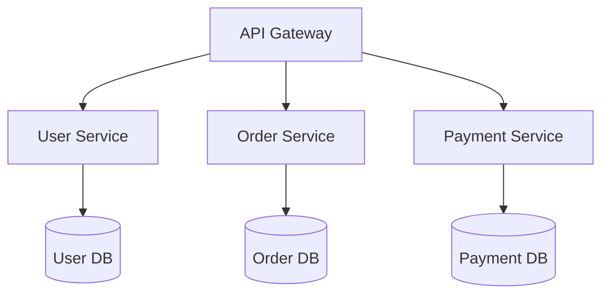
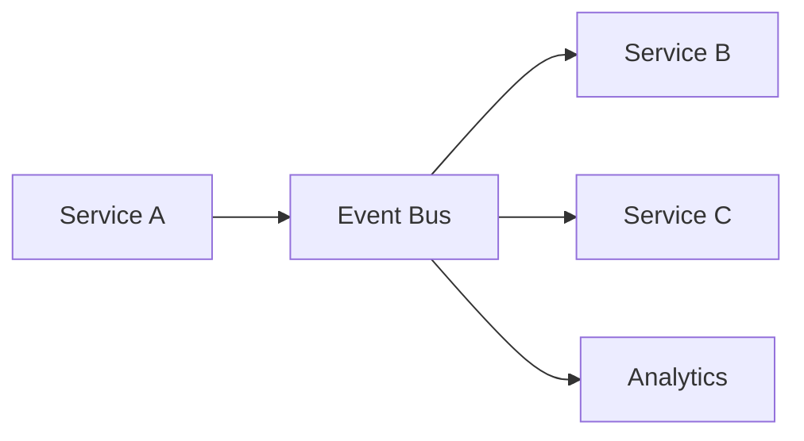

# 架構模式

## 微服務架構



### 何時使用
- ✅ 大型團隊 (>50 開發者)
- ✅ 不同部署週期需求
- ✅ 不同擴展需求
- ✅ 技術多樣性需求

### 何時避免
- ❌ 小型團隊 (<8 開發者)
- ❌ 簡單單一用途應用
- ❌ 所有元件緊密耦合
- ❌ DevOps 成熟度不足

## 事件驅動架構



### 優點
- 服務間鬆散耦合
- 高擴展性和彈性
- 即時資料處理

### 挑戰
- 事件排序和冪等性
- 分散式交易除錯
- 最終一致性處理

## 資料庫選擇框架

### 關聯式資料庫 (PostgreSQL, MySQL)
- ✅ 需要 ACID 合規
- ✅ 複雜查詢和 JOIN
- ✅ 強一致性需求

### NoSQL 文件儲存 (MongoDB)
- ✅ 彈性 schema 需求
- ✅ 水平擴展需求
- ✅ 快速開發週期

### 鍵值儲存 (Redis, DynamoDB)
- ✅ 簡單鍵值存取
- ✅ 極端效能需求
- ✅ 快取和 session

### 圖形資料庫 (Neo4j)
- ✅ 複雜關係查詢
- ✅ 社群網路功能
- ✅ 推薦引擎

## 擴展策略

```yaml
負載平衡:
  - Round-robin: 無狀態服務
  - Consistent hashing: 有狀態服務
  - Geographic: 全球應用

資料庫擴展:
  - Read replicas: 讀取密集型
  - Sharding: 寫入密集型
  - CQRS: 複雜讀寫模式

服務擴展:
  - Auto-scaling: 基於指標
  - Circuit breakers: 容錯
  - Bulkhead: 資源隔離
```

## 遷移模式

### Strangler Fig Pattern
1. 識別遷移邊界
2. 新舊系統並行建置
3. 逐步轉移流量
4. 漸進移除舊元件

### 零停機部署
- Blue-green: 即時切換
- Rolling updates: 漸進遷移
- Canary releases: 風險緩解
- Feature flags: 控制發布
